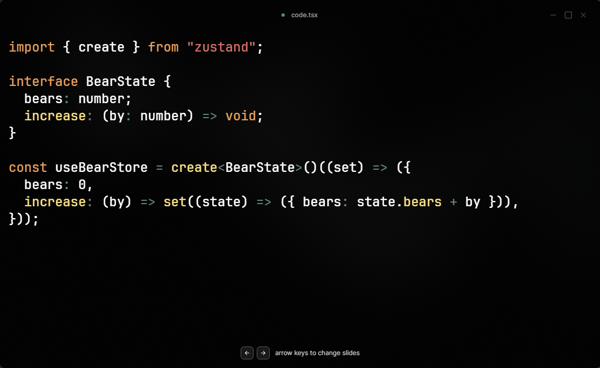

# Better Zustand Store

Write less boilerplate and get less rerenders with `zustand`

## Motivation

This package reduces the boilerplate needed to create a type-safe store in zustand:



## API

### Creating a store

```tsx
const store = createBetterStore({
  age: 0, //Number type inferred
  married: false, //boolean type inferred
  name: undefined as string | undefined, //If type cannot be inferred, us the 'as' keyword to specify the type
  status: "PENDING" as "PENDING" | "SUCCESS" | "FAILED",
});
```

### Reading store state

```tsx
const age = store.get("age");
```

### Writing store state

```tsx
store.set("age", 32);
```

### Usage in react

```tsx
const clickStore = createBetterStore({ numClicks: 0 });
const Component = () => {
  const numClicks = clickStore.use("numClicks");

  return (
    <div className="flex flex-col justify-center items-center">
      <div>This has been clicked {numClicks} time(s)!</div>
      <button
        onClick={() => {
          clickStore.set("numClicks", numClicks + 1);
        }}
      >
        Click me
      </button>
    </div>
  );
};
```

### Subscription outside of react

```ts
const authStore = createBetterStore({ isLoggedIn: false });

const unsub = authStore.subscribe("isLoggedIn", (newVal, oldVal) => {
  if (newVal === oldVal) return;
  if (newVal === false) return;
  //User is logged in
  console.log("Hooray! A login!");
});

//This will trigger the subscription
authStore.set("isLoggedIn", true);

//This will stop the subscription
unsub();
```

### Accessing underlying zustand store

```ts
const zustandStore = store.useStore;
```

## History

This was a very useful helper library that I used in my startup, [firejet](https://www.firejet.io), which converts figma designs to code. Check it out if you're free 😁

## Similary Libraries

[zustand-x](https://github.com/udecode/zustand-x)

Just after I made the npm release for this library, I discovered the extremely similar and more feature rich library [zustand-x](https://github.com/udecode/zustand-x), which also aims to improve the developer experience for zustand.

I've decided to keep this package up regardless, since the npm package name has already been taken. Moving forward, I'll do one of the following:

1. Keep it as an alternative to `zustand-x` with a smaller bundle size
2. Add more features that approach improving the developer experience differently from how `zustand-x` has done it

Any suggestions on how to take this library forward will be greatly appreciated, feel free to just make a post on the issues section

## Badges

[](https://coveralls.io/github/PhilipWee/better-zustand-store?branch=main)
